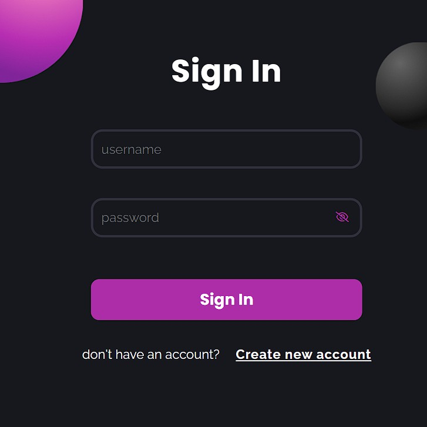
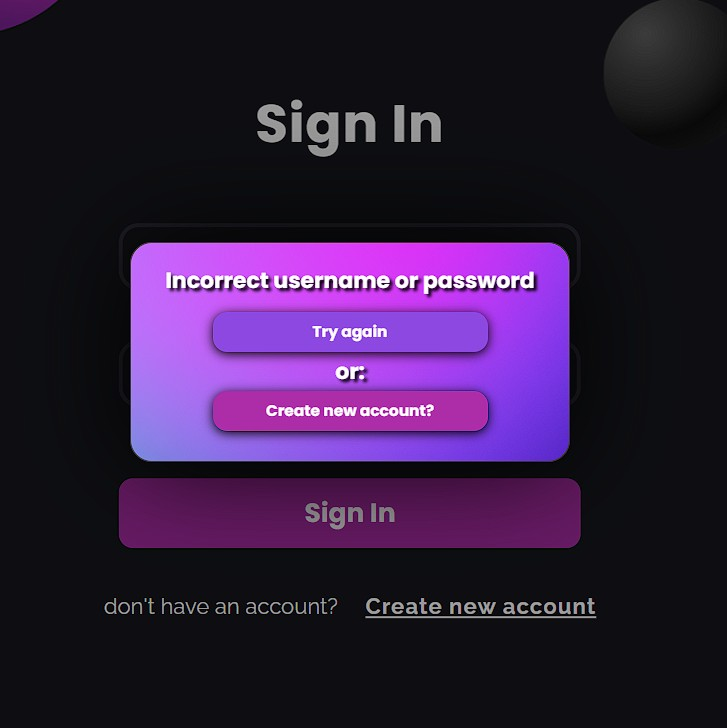
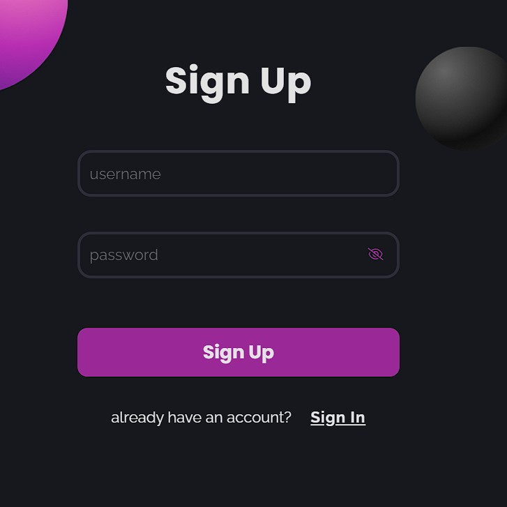
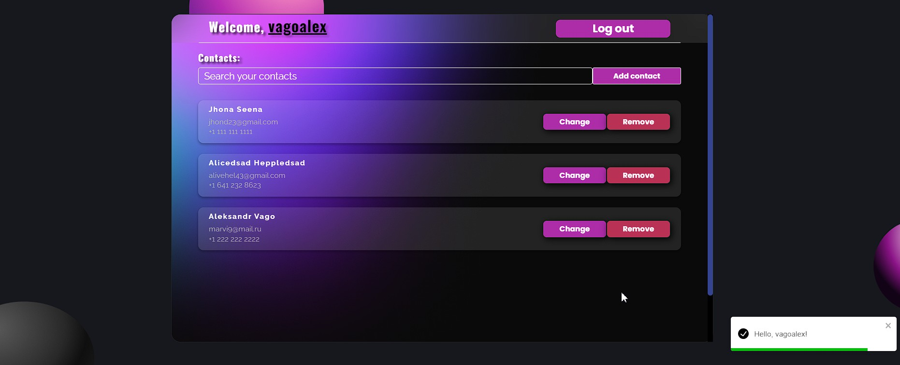
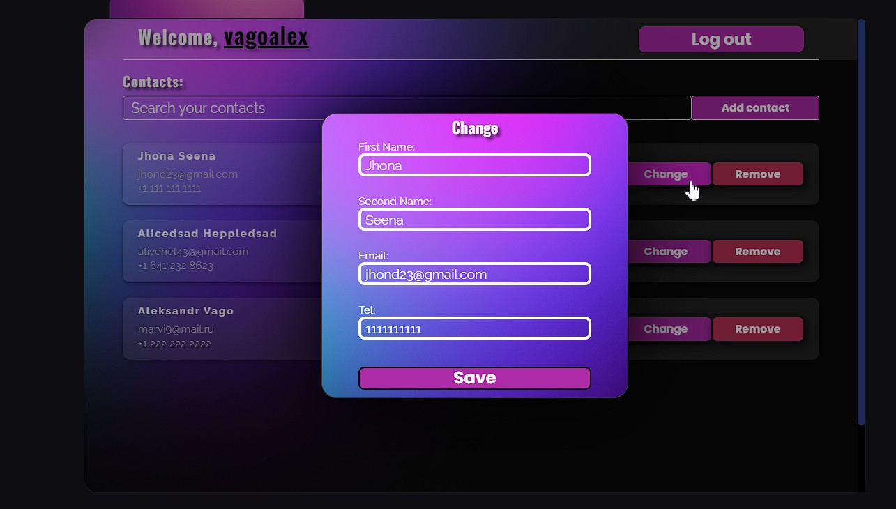
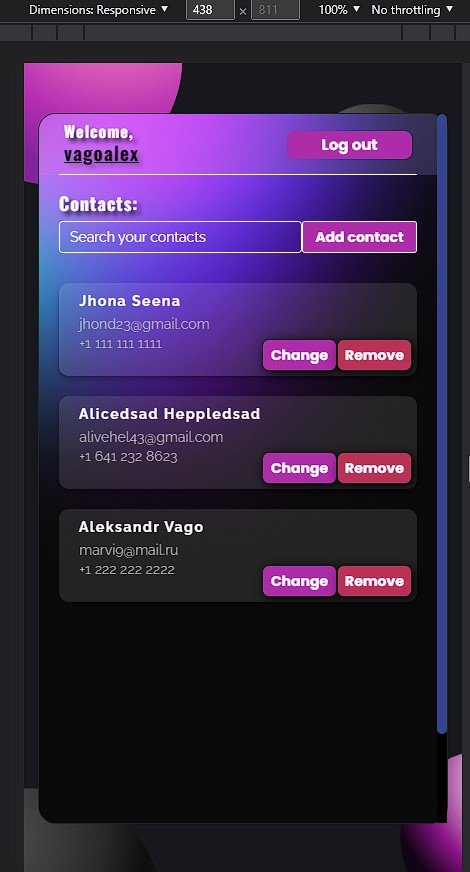

# Тестовое задание для компании Takeoff-staff

### Необходимо написать приложение личный кабинет.

#### В приложении должно быть две страницы:

- Страница входа
- Страница со списком контактов

### В реализации необходимо использовать:

- Задание необходимо выполнить на TypeScript, без использования any и ts-ignore.
- React + Redux Toolkit, TypeScript

### Условия:

- Страница со списком контактов пользователя должна быть доступна только после
  авторизации.
- На странице со списком контактов должна быть возможность
  добавлять/удалять/редактировать контакты, а также желательно наличие функции
  поиска.

---

## Версия nodeJS _v16.15.1_

## Клонируем репо:

```
npm install / npm i
```

## и:

```
npm start
```

---

[> Ссылка на деплой <](https://takeoff-staff-react-vagoalex.vercel.app/)

[> Ссылка на репо <](https://github.com/Vagoalex/Takeoff-staff-React)

## Инструкция:

- #### Изначально думал прикрутить mocapi и сервер, но там всего можно сделать 100 элементов и приложение быстро умрет, поэтому решил делать хранилище юзеров в store.

---

- #### Есть страница логина, автоматически заходит на нее, если user еще не вошел.
  
- #### Если пользователя не существует, вылетает модалка и просит зарегаться
   
- #### После входа перебрасывает на страницу /contacts
  
- #### На данной странице мы можем фильтровать контакты, добавлять новые, изменять существующие или удалять.
  
- #### Также, разумеется, имеется адаптив
  
